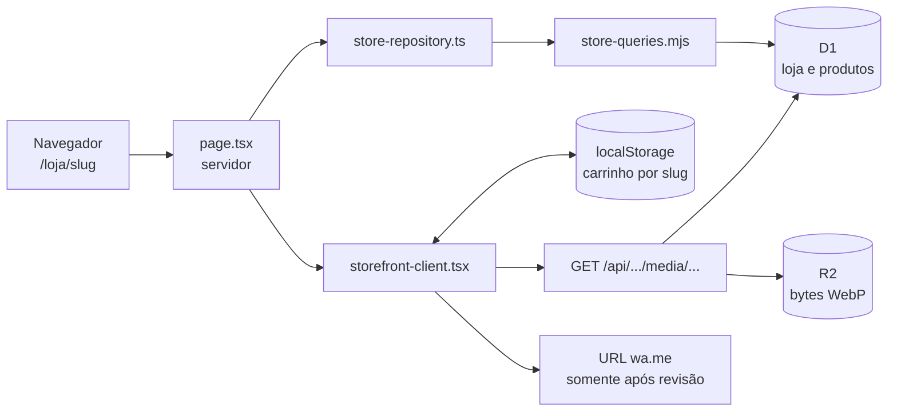

# Guia técnico da Feita

Este guia explica como compreender, executar e diagnosticar o Marco 4 sem
depender de memória de conversas anteriores. Ele não autoriza publicação,
acesso remoto, importação de dados reais ou alteração da política do Sites.

## Modelo mental em um minuto

A Feita tem hoje duas superfícies diferentes:

- `/` é o sandbox do painel. Seus produtos vivem no estado React do navegador
  e voltam à demonstração depois de recarregar.
- `/loja/[slug]` é a vitrine persistida. A loja e os produtos são lidos do D1
  no servidor; os bytes das imagens são lidos do R2 por uma rota `GET`; o
  carrinho fica no `localStorage` de cada navegador.

Não existe painel administrativo ligado ao D1, endpoint de importação ou API
pública de escrita. O único importador existente abre exclusivamente os
recursos locais do Miniflare.

“Rota pública”, neste guia, significa uma rota que não pede login próprio da
Feita. O checkpoint hospedado inteiro continua atrás da política `custom` do
Sites e, portanto, não está aberto à internet.



## Fluxo completo de uma vitrine

1. O navegador pede `/loja/alguma-loja`.
2. `app/loja/[slug]/page.tsx` recebe o slug e o valida.
3. `db/index.ts` obtém o binding `DB` do ambiente Cloudflare.
4. `db/store-repository.ts` normaliza o slug e chama as consultas
   parametrizadas de `db/store-queries.mjs`.
5. A primeira consulta procura uma loja publicada pelo slug. Loja inexistente
   ou não publicada termina em `404`.
6. O `id` encontrado no banco passa a ser o `tenant_id` da consulta de
   produtos. O navegador não escolhe esse identificador.
7. O repositório converte as linhas do D1 no objeto público da vitrine e monta
   URLs internas para logo, capa e produtos.
8. O servidor entrega esse objeto a `storefront-client.tsx`.
9. O componente cliente hidrata o carrinho a partir da chave
   `feita:cart:<slug>:v1` do `localStorage`. Itens removidos, ocultos, sem
   estoque ou com variação inválida são descartados.
10. Quando o navegador pede uma imagem, a rota de mídia consulta novamente o
    D1. Ela exige que slug publicado, mídia e `tenant_id` coincidam antes de
    buscar a chave do objeto no R2.
11. Ao revisar o pedido, `app/order.mjs` valida nome, itens, recebimento,
    endereço e pagamento, calcula o total e cria o texto.
12. A URL final usa o WhatsApp da loja e `encodeURIComponent`. Nada é enviado
    até a cliente decidir abrir o link e confirmar no WhatsApp.

## Onde cada tipo de dado vive

| Dado | Onde vive | Sobrevive ao recarregar? | Compartilhado entre navegadores? |
| --- | --- | --- | --- |
| Loja, identidade e WhatsApp | D1 | Sim | Sim |
| Produtos, estoque e metadados de mídia | D1 | Sim | Sim |
| Bytes de logo, capa e fotos | R2 | Sim | Sim |
| Carrinho da vitrine por slug | `localStorage` | Sim | Não |
| Estado do painel em `/` | memória React | Não | Não |
| Pedido revisado | memória React até abrir/fechar a revisão | Não | Não |
| Pedido enviado ou histórico | não existe persistência | Não se aplica | Não |

## Responsabilidade e arquivo principal

| Responsabilidade | Arquivo principal |
| --- | --- |
| Entrada da vitrine por slug e estados `404`/binding ausente | `app/loja/[slug]/page.tsx` |
| Interface, carrinho e checkout da vitrine | `app/loja/[slug]/storefront-client.tsx` |
| Regras do slug, lista e carrinho restaurado | `app/storefront.mjs` |
| Texto e URL do WhatsApp | `app/order.mjs` |
| Acesso aos bindings D1/R2 | `db/index.ts` e `db/bindings.mjs` |
| Leitura pública e montagem do objeto da loja | `db/store-repository.ts` |
| SQL parametrizado e isolamento por loja | `db/store-queries.mjs` |
| Modelo das tabelas | `db/schema.ts` |
| Criação física das tabelas e índices | `drizzle/0000_nostalgic_nextwave.sql` |
| Autorização e entrega de imagens | `app/api/public/stores/[slug]/media/[mediaId]/route.ts` |
| Importação validada somente local | `scripts/import-store.mjs` |
| D1/R2 locais compartilhados entre script e servidor | `scripts/local-bindings.mjs`, `vite.config.ts` e `wrangler.jsonc` |
| Headers HTTP e entrada do Worker | `worker/index.ts` |
| Vínculo lógico com o Sites | `.openai/hosting.json` |
| Testes de regressão | `tests/*.test.mjs` |

## Visita guiada pelos arquivos essenciais

### `app/loja/[slug]/page.tsx`

- **Finalidade:** entrada server-side da vitrine.
- **Entrada:** `params.slug` da URL e binding `DB`.
- **Saída:** `StorefrontClient`, `404` ou uma mensagem controlada de binding
  local ausente.
- **Dependências:** normalização de slug, D1 e repositório público.
- **Falhas possíveis:** slug inválido, binding ausente, migration não aplicada
  ou erro de consulta.
- **Alteração pequena segura:** mudar apenas um texto de estado; rodar lint,
  TypeScript e testes antes de manter a mudança.

### `db/index.ts` e `db/bindings.mjs`

- **Finalidade:** traduzir o ambiente Cloudflare em objetos D1/R2 e falhar com
  mensagem compreensível quando um binding não existe.
- **Entrada:** `env.DB` e `env.STORE_IMAGES`.
- **Saída:** `D1Database`, bucket de imagens ou `MissingLocalBindingError`.
- **Dependências:** `cloudflare:workers` e Drizzle.
- **Falhas possíveis:** nome de binding divergente ou execução fora do runtime
  preparado.
- **Alteração pequena segura:** se um nome lógico mudar, atualizá-lo em todos os
  arquivos de configuração, tipos, validações e testes; nunca mudar só aqui.

### `db/store-queries.mjs` e `db/store-repository.ts`

- **Finalidade:** executar SQL parametrizado e converter linhas em um objeto
  público da loja.
- **Entrada:** slug validado e banco D1.
- **Saída:** loja pública com produtos e URLs internas de mídia, ou `null`.
- **Dependências:** tabelas `stores`, `products`, `media`.
- **Falhas possíveis:** migration ausente, JSON inválido em campos de lista ou
  dados inconsistentes.
- **Alteração pequena segura:** adicionar um campo exige schema, migration,
  `SELECT`, conversão e teste no mesmo conjunto. Nunca aceite `tenant_id` vindo
  do navegador.

### `db/schema.ts` e `drizzle/0000_nostalgic_nextwave.sql`

- **Finalidade:** definir e materializar lojas, produtos, mídia, chaves e
  índices.
- **Entrada:** definição TypeScript do modelo e migrations versionadas.
- **Saída:** tabelas D1 coerentes com o código.
- **Dependências:** Drizzle e SQLite/D1.
- **Falhas possíveis:** alterar o schema sem gerar migration; editar migration
  já aplicada; remover índice ou filtro de tenant.
- **Alteração pequena segura:** alterar `db/schema.ts`, executar
  `npm run db:generate`, revisar o SQL gerado linha por linha e testar em banco
  local limpo. Migration aplicada deve ser corrigida por uma nova migration,
  nunca reescrita.

### `app/api/public/stores/[slug]/media/[mediaId]/route.ts`

- **Finalidade:** servir uma imagem sem expor o bucket.
- **Entrada:** slug e ID de mídia.
- **Saída:** bytes com MIME controlado, `404`, `503` ou erro genérico.
- **Dependências:** D1 para autorização e R2 para os bytes.
- **Falhas possíveis:** metadata sem objeto correspondente, binding ausente ou
  vínculo de tenant inválido.
- **Alteração pequena segura:** preservar `GET` como único método e manter a
  autorização D1 antes da leitura R2.

### `app/loja/[slug]/storefront-client.tsx`

- **Finalidade:** catálogo interativo, carrinho, checkout e revisão.
- **Entrada:** objeto `PublicStore` já filtrado no servidor e ações da cliente.
- **Saída:** interface, carrinho local e link revisável do WhatsApp.
- **Dependências:** `app/storefront.mjs`, `app/order.mjs` e CSS module.
- **Falhas possíveis:** estado antigo no `localStorage`, estoque alterado ou
  dados obrigatórios ausentes.
- **Alteração pequena segura:** para texto ou rótulo, mudar uma string, testar
  celular/desktop e rodar lint, TypeScript e testes. Não levar catálogo ou
  credenciais para `localStorage`.

### `app/storefront.mjs` e `app/order.mjs`

- **Finalidade:** concentrar regras puras testáveis de slug, telefone, carrinho,
  mensagem, dinheiro e URL.
- **Entrada:** valores do importador, catálogo e formulário.
- **Saída:** valores normalizados, carrinho saneado, mensagem e URL `wa.me`.
- **Dependências:** APIs padrão de JavaScript.
- **Falhas possíveis:** telefone inválido, carrinho vazio, entrega sem endereço
  ou codificação incompleta.
- **Alteração pequena segura:** escrever primeiro um caso em
  `tests/storefront.test.mjs` ou `tests/order-flow.test.mjs`, alterar a função e
  confirmar que casos antigos continuam passando.

### `scripts/import-store.mjs` e `scripts/local-bindings.mjs`

- **Finalidade:** validar uma fixture e, somente com `--apply`, gravá-la no
  D1/R2 local.
- **Entrada:** JSON local e arquivos de imagem referenciados.
- **Saída:** resumo de dry-run ou uma loja local; imagens válidas viram WebP.
- **Dependências:** Miniflare, Sharp, migration já aplicada e
  `.wrangler/state/v3`.
- **Falhas possíveis:** JSON inválido, slug repetido, imagem grande/falsa,
  banco sem tabelas ou escrita parcial. Objetos enviados na tentativa são
  removidos se o banco falhar.
- **Alteração pequena segura:** usar sempre uma cópia em `data/local/`, começar
  sem `--apply` e nunca adicionar `--remote`.

### `vite.config.ts`, `wrangler.jsonc` e `.openai/hosting.json`

- **Finalidade:** manter os mesmos nomes lógicos de binding no desenvolvimento,
  build e Sites.
- **Entrada:** configuração do projeto.
- **Saída:** runtime com `DB` e `STORE_IMAGES`.
- **Dependências:** Vite, Vinext, plugin Cloudflare e Sites.
- **Falhas possíveis:** um nome diferente em apenas um arquivo faz o código
  interpretar o binding como ausente; um identificador remoto não deve entrar
  na configuração local.
- **Alteração pequena segura:** trate os três arquivos como um conjunto e rode
  `npm run build`, que valida o manifesto empacotado.

### `worker/index.ts`

- **Finalidade:** encaminhar requisições ao Vinext e aplicar headers de
  segurança a todas as respostas.
- **Entrada:** requisição HTTP e bindings do Worker.
- **Saída:** resposta da aplicação com CSP, CORS fixo e demais headers.
- **Dependências:** Vinext, assets e serviço de imagens do runtime.
- **Falhas possíveis:** CSP bloquear um recurso legítimo ou um novo endpoint
  escapar dos headers se o retorno for movido para fora do invólucro.
- **Alteração pequena segura:** qualquer mudança de header deve vir com teste em
  `tests/rendered-html.test.mjs`.

## Ambientes

| Ambiente | Código | Dados | Uso |
| --- | --- | --- | --- |
| Desenvolvimento local | `npm run dev`, com HMR | D1/R2 em `.wrangler/` e carrinho no navegador local | Programar e experimentar |
| Prévia local do build | `npm run build` e depois `npm run start` | Continua local; não recebe acesso automático aos recursos hospedados | Validar o artefato compilado |
| Versão salva no Sites | Artefato empacotado, ainda não necessariamente publicado | Depende dos bindings administrados pelo Sites | Revisão antes de uma publicação autorizada |
| Produção | versão Sites atualmente ativa | D1/R2 hospedados e carrinho em cada navegador | Checkpoint restrito a Lorenzo |

O projeto não possui URL de preview ativa neste momento. Salvar versão,
publicar, alterar acesso e operar recursos remotos são ações separadas e exigem
autorização explícita.

## Superfícies de segurança existentes

- **Perímetro do Sites:** a configuração hospedada foi confirmada em modo
  somente leitura como `custom`, permitida somente a Lorenzo. Essa é a barreira
  efetiva do checkpoint publicado.
- **Sem escrita pública:** a única rota de API exporta `GET`. Não existe
  `POST`, `PUT`, `PATCH` ou `DELETE` administrativo.
- **Isolamento de leitura:** o slug seleciona uma loja publicada; o ID obtido
  no servidor seleciona os produtos por `tenant_id`.
- **Mídia autorizada antes do R2:** slug, publicação, ID de mídia e tenant
  precisam coincidir no D1.
- **Queries parametrizadas:** slug, tenant e ID de mídia usam `.bind(...)`.
- **Upload local endurecido:** tamanho, formato real e decodificação são
  validados; a imagem é reprocessada como WebP com chave aleatória.
- **Headers do Worker:** CSP, proteção contra framing, `nosniff`, política de
  referência, permissões mínimas, CORS fixo e HSTS em HTTPS.
- **Carrinho sem credencial:** `localStorage` contém somente IDs, variações e
  quantidades. Não contém sessão, token, catálogo ou configuração da loja.

`app/chatgpt-auth.ts` contém helpers para ler os headers de identidade do Sites,
mas não é importado por nenhuma rota atual. Portanto, ele não deve ser tratado
como autorização própria da aplicação; o controle vigente é a política do
Sites. Antes de um painel administrativo, a Feita ainda precisa implementar
autenticação e autorização por tenant conforme o ADR.

## Executar localmente

Requisitos: Node.js 22.13 ou superior, npm e Git for Windows. Nesta estação, o
Git Bash não está no `PATH` padrão do PowerShell, mas os scripts de lint e build
usam Bash:

```powershell
Set-Location 'C:\Users\USUARIO\Documents\feita'
$env:Path = 'C:\Program Files\Git\bin;' + $env:Path
npm install
npm run db:migrate:local
npm run dev
```

Use exatamente a URL que o Vite imprimir. Pare com `Ctrl+C`.

### Validação completa

```powershell
$env:Path = 'C:\Program Files\Git\bin;' + $env:Path
npm run lint
npx tsc --noEmit
npm test
npm run build
git diff --check
```

`npm test` também executa o build. Rodar `npm run build` separadamente continua
útil para registrar explicitamente o resultado pedido na entrega.

## Criar um banco local limpo sem destruir o anterior

Pare o servidor. Em vez de apagar `.wrangler`, mova o estado atual para uma
pasta de backup já ignorada pelo Git:

```powershell
Set-Location 'C:\Users\USUARIO\Documents\feita'
$feitaRoot = (Resolve-Path -LiteralPath '.').Path
if ($feitaRoot -ne 'C:\Users\USUARIO\Documents\feita') {
  throw "Pasta inesperada: $feitaRoot"
}
$stamp = Get-Date -Format 'yyyyMMdd-HHmmss'
New-Item -ItemType Directory -Force -Path 'work\local-backups' | Out-Null
if (Test-Path -LiteralPath '.wrangler') {
  Move-Item -LiteralPath '.wrangler' -Destination "work\local-backups\wrangler-$stamp"
}
$env:Path = 'C:\Program Files\Git\bin;' + $env:Path
npm run db:migrate:local
```

Isso cria um D1 local novo quando a migration é aplicada. O R2 local nasce
vazio quando for usado. Nenhum comando contém `--remote`.

Para restaurar um backup, pare o servidor, mova a `.wrangler` atual para outro
nome dentro de `work/local-backups` e mova o backup escolhido de volta para
`.wrangler`.

## Aplicar e conferir migrations

```powershell
npm run db:migrate:local
npx wrangler d1 migrations list feita-local --local
npx wrangler d1 execute feita-local --local --command "SELECT name FROM sqlite_master WHERE type = 'table' ORDER BY name;"
```

Resultado esperado: a aplicação da migration termina sem erro; `stores`,
`products` e `media` aparecem na consulta. A lista de migrations mostra apenas
arquivos ainda não aplicados. Nunca acrescente `--remote` para “tentar de novo”.

## Importar fixture somente localmente

`data/local/` é ignorado pelo Git para reduzir o risco de versionar dados de
trabalho.

```powershell
New-Item -ItemType Directory -Force -Path 'data\local' | Out-Null
Copy-Item -LiteralPath 'data\first-store.example.json' -Destination 'data\local\loja-exercicio.json'
npm run store:import -- data/local/loja-exercicio.json
```

O primeiro comando do importador é apenas dry-run. Depois de ler o resumo, uma
fixture fictícia pode ser gravada **somente no ambiente local** com:

```powershell
npm run store:import -- data/local/loja-exercicio.json --apply
```

Não use dados reais neste exercício. Não existe opção remota no importador.

## Diagnóstico por sintoma

### Erro de D1

Sinais:

- página diz que a vitrine não foi preparada neste computador: binding `DB`
  ausente;
- terminal mostra `no such table`: binding existe, mas falta migration;
- `404` para slug conhecido: a loja não existe nesse banco, está não publicada
  ou o slug é diferente.

Verificações:

```powershell
npx wrangler d1 migrations list feita-local --local
npx wrangler d1 execute feita-local --local --command "SELECT slug, published FROM stores ORDER BY slug;"
node --test --test-name-pattern="migração limpa" tests/local-persistence.test.mjs
```

### Erro de R2

Sinais:

- `503 Armazenamento local indisponível`: binding `STORE_IMAGES` ausente;
- `404 Imagem não encontrada`: metadata não autorizada, objeto ausente ou mídia
  de outra loja;
- vitrine abre, mas uma imagem falha: D1 pode estar saudável e apenas o objeto
  R2 estar ausente.

Comece consultando a relação autorizada no D1 local:

```powershell
npx wrangler d1 execute feita-local --local --command "SELECT id, tenant_id, object_key, content_type FROM media ORDER BY created_at;"
```

Com uma chave fictícia conhecida, o objeto local pode ser verificado sem
produção:

```powershell
npx wrangler r2 object get "feita-local-images/CHAVE_DO_OBJECT_KEY" --local --file "work\imagem-diagnostico.webp"
```

Não use `--remote`.

### Loja inexistente

1. Valide o formato: minúsculas, números e hífens, até 63 caracteres.
2. Consulte `stores` localmente com o comando acima.
3. Confirme `published = 1`.
4. Se o registro existe, rode o teste de persistência para separar defeito de
   código de problema no estado local.
5. Lembre que loja inválida, ausente e não publicada resultam em `404` por
   segurança.

### Conferir a URL do WhatsApp sem enviar mensagem

Pelo teste puro, sem navegador:

```powershell
node --input-type=module -e "import { buildWhatsAppUrl } from './app/order.mjs'; console.log(buildWhatsAppUrl('Teste local', '5511999999999'))"
```

Na interface local, chegue à etapa de revisão, abra as ferramentas do navegador
e inspecione o atributo `href` do link **Abrir WhatsApp**. Confira:

- começa com `https://wa.me/`;
- contém apenas dígitos no telefone;
- contém `?text=`;
- acentos, espaços e quebras estão codificados.

Não clique, não use “abrir em nova aba” e não pressione Enter no link.

### Confirmar que não há escrita anônima

Inspeção estática:

```powershell
rg -n "export async function (GET|POST|PUT|PATCH|DELETE)" app/api
```

O resultado atual contém somente `GET`. Com o servidor local aberto, confirme
que um método mutável é recusado:

```powershell
curl.exe -i -X POST "http://localhost:PORTA/api/public/stores/loja-teste/media/media-teste"
```

Troque `PORTA` pela porta impressa pelo Vite. O esperado é `405 Method Not
Allowed`; nunca use a URL de produção nesse exercício.

## Como interpretar os testes

| Arquivo | O que uma falha normalmente significa |
| --- | --- |
| `tests/rendered-html.test.mjs` | regressão de renderização, headers, HSTS ou CORS |
| `tests/order-flow.test.mjs` | cálculo, validação do checkout ou URL do WhatsApp |
| `tests/storefront.test.mjs` | slug/telefone, carrinho, binding ou processamento de imagem |
| `tests/local-persistence.test.mjs` | migration, persistência D1/R2, isolamento entre lojas ou superfície pública de escrita |

Uma execução boa termina com `pass 22`, `fail 0`. Um teste de arquivo isolado
ajuda a diagnosticar, mas a entrega só está saudável depois de `npm test`
completo.

## Recuperar a última versão funcional sem destruir dados

Não use `git reset --hard`, não apague `.wrangler` e não reverta migration já
aplicada.

1. Confirme o estado e encontre o commit:

   ```powershell
   git status --short --branch
   git log --oneline --decorate -10
   ```

2. Abra o commit anterior em uma pasta separada:

   ```powershell
   git worktree add '..\feita-recuperacao' COMMIT
   ```

3. Instale, migre um banco **local novo** e rode as validações nessa worktree.
4. Se a correção for apenas de código, volte à `main`, crie uma branch
   `codex/recuperacao-AAAA-MM-DD` e use `git revert COMMIT_RUIM`. Revise o diff
   e teste antes de qualquer push.
5. Para produção, código e dados são recuperações diferentes: uma versão Sites
   anterior pode recuperar código, mas migrations devem avançar com uma nova
   correção. Antes de qualquer ação remota, exporte D1, inventarie R2 e peça
   autorização explícita.

## Exercícios operacionais

### 1. Alterar um texto visual localmente

- **Arquivo:** `app/loja/[slug]/storefront-client.tsx`.
- **Exercício:** troque localmente `Continuar pedido` por `Revisar pedido`.
- **Mudança esperada:** apenas o rótulo do botão do carrinho muda.
- **Validação:**

  ```powershell
  npm run lint
  npx tsc --noEmit
  git diff -- app/loja/[slug]/storefront-client.tsx
  ```

- **Desfazer:** se o arquivo estava limpo antes, inspecione o diff e execute
  `git restore -- "app/loja/[slug]/storefront-client.tsx"`. Se já havia outra
  mudança, use o desfazer do editor apenas na linha do exercício.

### 2. Adicionar um produto somente à fixture local

- **Arquivo:** `data/local/loja-exercicio.json`.
- **Exercício:** copie o exemplo conforme a seção de importação e acrescente um
  produto fictício com preço em centavos, estoque, `published` e `available`.
- **Mudança esperada:** o dry-run aumenta a contagem em um produto; com
  `--apply`, apenas o D1 local recebe a fixture.
- **Validação:**

  ```powershell
  npm run store:import -- data/local/loja-exercicio.json
  git status --short
  ```

  `git status` não deve listar o arquivo, pois `data/local/` é ignorado.
- **Desfazer:** remova apenas
  `data/local/loja-exercicio.json`. Se aplicou a fixture, restaure o backup
  `.wrangler` conforme a seção de banco limpo; não apague dados remotos.

### 3. Simular binding ausente e interpretar o erro

- **Arquivo envolvido:** `db/bindings.mjs`, exercitado por
  `tests/storefront.test.mjs`.
- **Exercício:** execute a simulação já existente; ela passa um ambiente vazio
  para `DB` e `STORE_IMAGES`.
- **Mudança esperada:** nenhuma alteração de arquivo. O teste confirma
  `MissingLocalBindingError`, cita o binding ausente e orienta a usar somente
  recursos locais.
- **Validação:**

  ```powershell
  node --test --test-name-pattern="falta de D1 ou R2" tests/storefront.test.mjs
  ```

- **Desfazer:** nada a desfazer. Não edite `.openai/hosting.json` nem
  `wrangler.jsonc` para simular essa falha.

## Cinco falhas mais prováveis

1. **Git Bash fora do `PATH`:** `bash` não é reconhecido. Acrescente
   `C:\Program Files\Git\bin` ao `PATH` da sessão.
2. **Migration local ausente:** D1 responde `no such table`. Execute
   `npm run db:migrate:local`.
3. **Fixture no banco local errado ou slug divergente:** a vitrine retorna
   `404`. Liste `slug` e `published` no D1 local.
4. **Metadata D1 sem objeto R2:** catálogo abre, imagem retorna `404`. Confira
   `media.object_key` e teste o objeto local.
5. **Carrinho antigo incompatível:** item some ou quantidade diminui após
   recarregar. Isso é saneamento esperado quando produto, variação,
   disponibilidade ou estoque mudou; inspecione a chave
   `feita:cart:<slug>:v1`.

## Glossário

- **Binding:** nome lógico que entrega um recurso ao Worker, como `DB`.
- **D1:** banco SQL compatível com SQLite usado para dados estruturados.
- **R2:** armazenamento de objetos usado para os bytes das imagens.
- **Migration:** SQL versionado que evolui a estrutura do banco.
- **Slug:** parte estável e legível da URL que identifica a loja.
- **Tenant:** loja à qual um registro pertence.
- **`tenant_id`:** coluna usada para impedir mistura entre lojas.
- **Server-side:** código executado no Worker, fora do navegador.
- **Hidratação:** momento em que o React ativa a interface entregue pelo
  servidor.
- **`localStorage`:** armazenamento do navegador; é local ao perfil/dispositivo.
- **Fixture:** conjunto fictício e controlado usado em testes locais.
- **Dry-run:** validação que não grava dados.
- **Worker:** processo server-side que recebe as requisições da aplicação.
- **Sites:** serviço que mantém versões, acesso e publicação do projeto.
