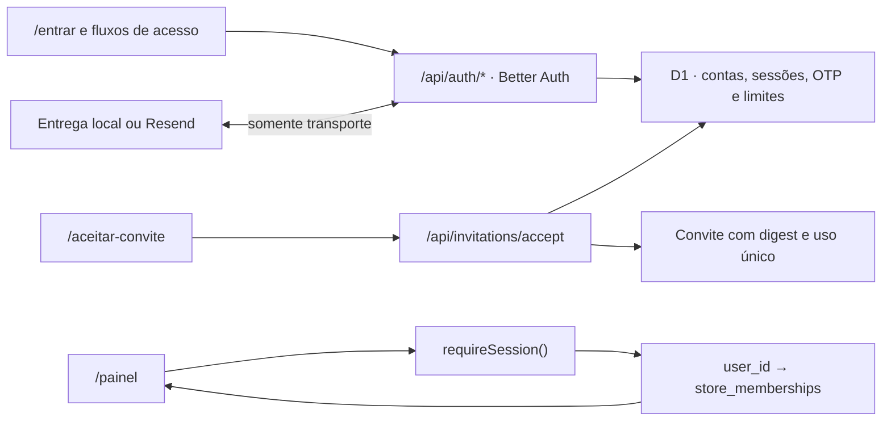

# Marco 5 — autenticação e isolamento entre lojas

Data do checkpoint local: **29 de julho de 2026**

Status: **implementado e validado localmente; não publicado**

Este marco cria a fundação de contas da Feita sem habilitar edição de catálogo.
A vitrine pública continua independente de login. Comerciantes entram somente
depois de receber um convite previamente ligado a uma loja e a um papel.

## Arquitetura implementada



| Responsabilidade | Arquivo |
|---|---|
| Better Auth, cookies, OTP e limites | `auth/server.ts` |
| handler `/api/auth/*` e bloqueio do signup público | `app/api/auth/[...all]/route.ts` |
| sessão e autorização por loja | `auth/authorization.ts` |
| criação/aceitação de convite | `auth/invitations.ts` |
| rate limit complementar por identidade | `auth/security.ts` |
| entrega local e adaptador Resend | `auth/email.ts` |
| cliente e porta para provedores futuros | `auth/client.ts` |
| interfaces compartilhadas | `app/auth/*` |
| área protegida mínima | `app/painel/page.tsx` |
| schema D1 | `db/schema.ts` |
| migration do marco | `drizzle/0001_shallow_robbie_robertson.sql` |

O Better Auth está fixado em uma versão estável no `package-lock.json` e usa o
adapter Drizzle sobre D1. A Feita não implementa hash ou verificação de senha.

## Fluxo de login

1. A comerciante informa e-mail e senha em `/entrar`.
2. O cliente oficial chama `POST /api/auth/sign-in/email` no mesmo domínio.
3. Better Auth verifica origem, limite por IP e credenciais.
4. Um hook aplica também limite persistente por HMAC do e-mail normalizado. O
   e-mail cru não é guardado na tabela de limites.
5. A sessão é persistida no D1 e o navegador recebe somente o cookie.
6. `/painel` chama `requireSession()` no servidor. Cookie sem sessão válida não
   concede acesso.
7. O painel busca `store_memberships` pelo `user_id` da sessão e mostra somente
   os dados mínimos das lojas permitidas.

Falhas de credencial usam mensagem genérica na interface.

## Fluxo de recuperação

1. `/esqueci-minha-senha` envia somente o e-mail.
2. A resposta visual é a mesma para conta existente e inexistente.
3. O plugin Email OTP gera código de seis dígitos com duração de dez minutos,
   três tentativas e rotação no reenvio.
4. O código é armazenado pelo Better Auth somente como hash.
5. A entregadora local captura a mensagem apenas em memória quando um teste
   injeta callback; não usa rede nem imprime código.
6. Com `RESEND_API_KEY` e `RESEND_FROM`, o adaptador Resend transporta o código.
   Better Auth continua responsável pelo token.
7. `/redefinir-senha` recebe e-mail, código e nova senha. Código expirado ou já
   utilizado é recusado.
8. A redefinição revoga as sessões anteriores.

Não existe token de recuperação em URL, `localStorage`, log ou resposta.

## Fluxo de convite

1. `createStoreInvitation()` recebe loja e papel definidos pelo servidor.
2. Um código aleatório é entregue; o D1 guarda somente SHA-256.
3. A usuária digita código, nome, e-mail e senha em `/aceitar-convite`.
4. O servidor exige origem permitida, aplica rate limit e reivindica o convite
   atomicamente.
5. Somente então cria a conta pelo Better Auth.
6. O servidor marca o e-mail como verificado, cria `store_memberships`, consome
   o convite e registra `invitation.accepted` em um lote D1.
7. O mesmo convite não pode ser usado novamente.

Não existe endpoint público para emitir convite. Neste checkpoint a emissão é
uma abstração server-side exercitada nos testes locais. Uma futura operação de
emissão exige autorização explícita de `platform_admin`.

Uma conta já existente convidada para uma segunda loja ainda não é vinculada
automaticamente. Esse fluxo futuro deverá exigir sessão válida da mesma conta,
além do convite.

## Modelo de autorização

```text
cookie → sessão válida → user_id → store_memberships → store_id permitido
```

`requireStoreMembership()` combina `user_id` validado e o identificador de uma
loja obtido de um recurso server-side. `store_id`, `tenant_id`, papel ou
`user_id` enviados pelo navegador não substituem a consulta.

Papéis atuais:

- `store_owner`: responsável por uma loja;
- `platform_admin`: administração futura da plataforma.

O papel pertence ao vínculo, não à conta. Uma conta pode ter vários vínculos.
D1 não oferece RLS; o helper server-side e os testes com duas lojas são
barreiras de publicação.

## Tabelas e migration

A migration `0001_shallow_robbie_robertson.sql` adiciona:

- `user`, `session`, `account` e `verification` para Better Auth;
- `rate_limit` para limite persistente por IP;
- `auth_identity_rate_limits` para limite por HMAC da identidade;
- `store_memberships` com unicidade por usuário e loja;
- `store_invites` com digest, expiração, reivindicação e uso único;
- `audit_events` com metadados mínimos e não sensíveis.

Ela preserva `stores`, `products`, `media` e a migration do Marco 4.

Aplicação somente local:

```powershell
npm run db:migrate:local
```

Nenhuma migration hospedada foi aplicada.

## Cookies e segredos

Em HTTPS, o cookie é `HttpOnly`, `Secure`, `SameSite=Lax`, `Path=/` e não possui
`Domain`. Rotas de autenticação, convite e `/painel` recebem
`Cache-Control: private, no-store`.

| Nome | Uso |
|---|---|
| `BETTER_AUTH_SECRET` | assinatura e criptografia interna |
| `RATE_LIMIT_HMAC_SECRET` | HMAC do e-mail normalizado |
| `BETTER_AUTH_URL` | origem canônica |
| `AUTH_TRUSTED_ORIGINS` | origens adicionais exatas, separadas por vírgula |
| `RESEND_API_KEY` | chave privada do Resend |
| `RESEND_FROM` | remetente verificado |

Os defaults versionados só funcionam em origens locais conhecidas. A origem de
produção recusa inicialização sem os dois segredos criptográficos. Não usar
curingas em `AUTH_TRUSTED_ORIGINS`.

## Configuração futura do Resend

1. escolher conta, domínio e remetente;
2. verificar o domínio no Resend;
3. configurar `RESEND_API_KEY` e `RESEND_FROM` apenas no runtime do Sites;
4. executar teste controlado com endereços próprios;
5. revisar falhas sem registrar e-mail completo, código ou URL sensível;
6. somente depois autorizar publicação.

O adaptador usa `fetch` compatível com Cloudflare Worker. Sem as duas variáveis,
o runtime local usa a entregadora sem rede. Nenhum e-mail real foi enviado.

## Revogar sessão ou conta

Executar somente por operação server-side autorizada, nunca por rota pública.

Revogar todas as sessões:

```sql
DELETE FROM session WHERE user_id = ?1;
```

Retirar o acesso a uma loja sem apagar a conta:

```sql
DELETE FROM store_memberships
WHERE user_id = ?1 AND store_id = ?2;
```

Antes de existir um campo próprio de suspensão, remover vínculos e sessões no
mesmo procedimento e registrar `audit_events` sem dados sensíveis. Exclusão
definitiva depende da política de retenção.

## Testes automatizados

`npm test` prova:

- anônimo recusado em `/painel`;
- login criando sessão e logout invalidando-a;
- expiração e revogação;
- duas usuárias/lojas sem leitura cruzada;
- `store_id` adulterado sem conceder acesso;
- conta sem membership recebendo 403;
- recuperação equivalente para e-mail existente e ausente;
- código expirado e reutilizado recusados;
- redefinição revogando sessões anteriores;
- rate limit D1 retornando 429;
- origem externa/CSRF recusada;
- segredo ausente do bundle e respostas;
- migration em D1 limpo;
- signup público recusado;
- atributos seguros do cookie;
- formulários acessíveis e sem provedores falsos;
- regressão da vitrine e do Marco 4.

## Riscos e portões antes de produção

1. A migration existe apenas no Git/local.
2. Secrets de produção ainda não foram configurados.
3. Conta, domínio e remetente Resend ainda não foram escolhidos/verificados.
4. Emissão de convite ainda não possui superfície autenticada.
5. Convite de conta existente para outra loja requer decisão adicional.
6. Não houve ensaio de e-mail real nem validação no runtime publicado.
7. D1 não tem RLS; toda futura consulta administrativa exige o contexto de
   autorização e teste IDOR.
8. Nenhum CRUD administrativo deve ser publicado antes desses portões.

## n8n

n8n está completamente fora do caminho crítico. Login, sessão, convite,
recuperação, e-mail e autorização não importam, chamam ou dependem de n8n.
